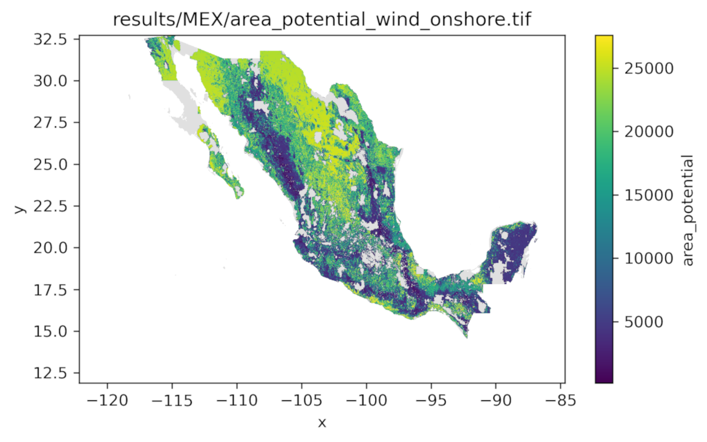
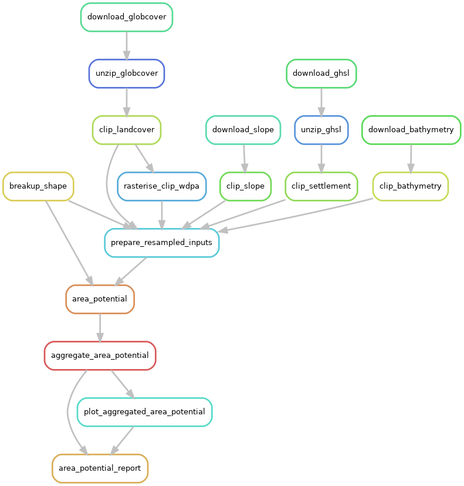

# Area potentials

This module performs geospatial analyses to determine the available land area for specific technologies, on a by-pixel basis and aggregated to given geographic boundaries.

<!-- Place an attractive image of module outputs here -->
<p align="center">
  
</p>

## About
<!-- Please do not modify this templated section -->

This is a modular `snakemake` workflow created as part of the [Modelblocks project](https://www.modelblocks.org/). It can be imported directly into any `snakemake` workflow.

For more information, please consult the Modelblocks [documentation](https://modelblocks.readthedocs.io/en/latest/),
the [integration example](./tests/integration/Snakefile),
and the `snakemake` [documentation](https://snakemake.readthedocs.io/en/stable/snakefiles/modularization.html).

## Overview
<!-- Please describe the processing stages of this module here -->

Data processing steps:

<p align="center">
  
</p>


* Geospatial input data (vector and raster) are acquired. This is automatic for most data, but the following data need to be manually supplied:
  * Geographic boundaries in the parquet format
  * WDPA protected areas database from https://www.protectedplanet.net/ in GeoDB format (choose 'File Geodatabase' when downloading).
* For the extent of the provided boundaries, the input data are reprojected and rasterised to the resolution of the land cover data (GlobCover), and merged into a single dataset for further processing.
* Based on the supplied configuration, the land-use analysis is done for each defined technology.
* Results can be reported on a per-geography and per-technology basis, as pixel surface area values (TIFF files), images for reporting purposes (PNG files), and also as a summary report with per-region capacities (CSV and HTML files)

See below for the [data sources](#references).

## Configuration
<!-- Please describe how to configure this module below -->

Please consult the configuration [README](./config/README.md) and the [configuration example](./config/config.yaml) for a general overview on the configuration options of this module.

In the configuration, you can define any number of `techs`, and for each of them, specify the `initial_area`, `continuous_layers`, and `binary_layers`.

By example, here is a `pv_rooftop` tech. We use the `settlement_area`, which is the settlement area in m² in each pixel, as the initial area from which the further analysis proceeds. In `continuous_layers`, we use the `settlement_share`, which is the share (0-1) of area covered by settlement, and exclude pixels with less than 0.01 settlement share while assuming that of those pixels not excluded by that, 0.8 (80%) of the settled area can be used for rooftop PV. Finally, in the `binary_layers`, we include all land use types except `NOT_SUITABLE` (since the main selection is done via the settlement_share). This means that, for example, `FOREST` pixels with a `settlement_area` > 0 can be included.

```yaml
pv_rooftop:
  initial_area: settlement_area
  continuous_layers:
    settlement_share:
      min: 0.01
      max: 1
      share: 0.8
  binary_layers:
    regions_maritime: 0
    regions_land: 1
    protected: 0
    landcover_FARM: 1
    landcover_FOREST: 1
    landcover_URBAN: 1
    landcover_OTHER: 1
    landcover_NOT_SUITABLE: 0
    landcover_WATER: 0
```

Here is a `wind_offshore` example. We start with the `pixel_area`, the total surface area in m² for each pixel. We include pixels with a slope up to and including 20 degrees, and exclude pixels with a settlement share above 0.01. Furthermore, we include only land areas (`regions_land: 1` and `regions_maritime: 0`) and completely exclude some areas like protected areas or urban areas (`protected: 0`, `landcover_URBAN: 0`), while including only a fraction of other areas (e.g. if a pixel is considered farmland, only 20% of its surface is available: `landcover_FARM: 0.2`).

```yaml
wind_onshore:
  initial_area: pixel_area
  continuous_layers:
    slope:
    min: 0
    max: 20
    settlement_share:
    min: 0
    max: 0.01
  binary_layers:
    regions_maritime: 0
    regions_land: 1
    protected: 0
    landcover_FARM: 0.2
    landcover_FOREST: 0.05
    landcover_URBAN: 0
    landcover_OTHER: 0.3
    landcover_NOT_SUITABLE: 0
    landcover_WATER: 0

```


## Input / output structure
<!-- Please describe input / output file placement below -->

Please consult the [interface file](./INTERFACE.yaml) for more information.

## Development
<!-- Please do not modify this templated section -->

We use [`pixi`](https://pixi.sh/) as our package manager for development.
Once installed, run the following to clone this repository and install all dependencies.

```shell
git clone git@github.com:modelblocks-org/module_area_potentials.git
cd module_area_potentials
pixi install --all
```

Please be aware that this is a multi-environment project (see [pixi.toml](./pixi.toml) for details).
- `default`: used for development and integration testing.
Because it contains `Snakemake`, `conda` and `pytest` as dependencies it **should not be used** in `Snakemake` rules.
- `module`: contains minimal dependencies used in `Snakemake` rules.
If modified, be sure to export it to `Snakemake` so it can be recreated by module users:

```shell
# create module.yaml and conda-spec pin files in workflow/envs/
pixi run export-snakemake-env module
```


## Testing
<!-- Please do not modify this templated section -->

For testing, simply run:

```shell
pixi run test-integration
```

To test a minimal example of a workflow using this module:

```shell
pixi shell    # activate this project's environment
cd tests/integration/  # navigate to the integration example
snakemake --use-conda --cores 2  # run the workflow!
```

## References
<!-- Please provide thorough referencing below -->

This module is based on the following research and datasets:

* [GEDTM30](https://github.com/openlandmap/GEDTM30) for slope
    * License: Creative Commons Attribution 4.0 International
* [GlobCover land cover data](https://due.esrin.esa.int/page_globcover.php)
    * License: "You may use the GlobCover land cover map for educational and/or scientific purposes, without any fee on the condition that you credit ESA and the Université Catholique de Louvain as the source of the GlobCover products."
* [GEBCO (General Bathymetric Chart of the Oceans)](https://www.gebco.net/data-products/gridded-bathymetry-data) 15 arc-second data
    * License: "The GEBCO Grid is placed in the public domain and may be used free of charge. [...] Users must: Acknowledge the source of The GEBCO Grid. A suitable form of attribution is given in the documentation that accompanies The GEBCO Grid."
* [GHSL (Global Human Settlement Layer)](https://human-settlement.emergency.copernicus.eu/download.php) built-up surface data (R2023, GHS-BUILT-S, 100m resolution)
    * License: "The GHSL has been produced by the EC JRC as open and free data. Reuse is authorised, provided the source is acknowledged."
* [WDPA (World Database on Protected Areas)](https://www.protectedplanet.net/)
    * License: Non-commercial allowed. Citation: "UNEP-WCMC and IUCN (2025), Protected Planet: The World Database on Protected Areas (WDPA) and World Database on Other Effective Area-based Conservation Measures (WD-OECM) [Online], June 2025, Cambridge, UK: UNEP-WCMC and IUCN. Available at: www.protectedplanet.net."

## Contributors ✨

Thanks goes to these wonderful people, sorted alphabetically ([emoji key](https://allcontributors.org/en/reference/emoji-key/)):

<!-- ALL-CONTRIBUTORS-LIST:START - Do not remove or modify this section -->
<!-- prettier-ignore-start -->
<!-- markdownlint-disable -->
<table>
  <tbody>
    <tr>
      <td align="center" valign="top" width="14.28%"><a href="https://orcid.org/0000-0003-2288-6423"><br /><sub><b>Ivan Ruiz Manuel</b></sub></a><br /><a href="https://github.com/modelblocks-org/module_area_potentials/commits?author=irm-codebase" title="Code">💻</a></td>
      <td align="center" valign="top" width="14.28%"><a href="https://github.com/jnnr"><br /><sub><b>Jann Launer</b></sub></a><br /><a href="#ideas-jnnr" title="Ideas, Planning, & Feedback">🤔</a></td>
      <td align="center" valign="top" width="14.28%"><a href="https://github.com/LinhHo"><br /><sub><b>Linh Ho</b></sub></a><br /><a href="https://github.com/modelblocks-org/module_area_potentials/commits?author=LinhHo" title="Code">💻</a> <a href="#ideas-LinhHo" title="Ideas, Planning, & Feedback">🤔</a></td>
      <td align="center" valign="top" width="14.28%"><a href="https://github.com/sjpfenninger"><br /><sub><b>Stefan Pfenninger-Lee</b></sub></a><br /><a href="https://github.com/modelblocks-org/module_area_potentials/commits?author=sjpfenninger" title="Code">💻</a> <a href="https://github.com/modelblocks-org/module_area_potentials/commits?author=sjpfenninger" title="Documentation">📖</a> <a href="#ideas-sjpfenninger" title="Ideas, Planning, & Feedback">🤔</a></td>
    </tr>
  </tbody>
</table>

<!-- markdownlint-restore -->
<!-- prettier-ignore-end -->
<!-- ALL-CONTRIBUTORS-LIST:END -->

This project follows the [all-contributors](https://github.com/all-contributors/all-contributors) specification. Contributions of any kind welcome!
